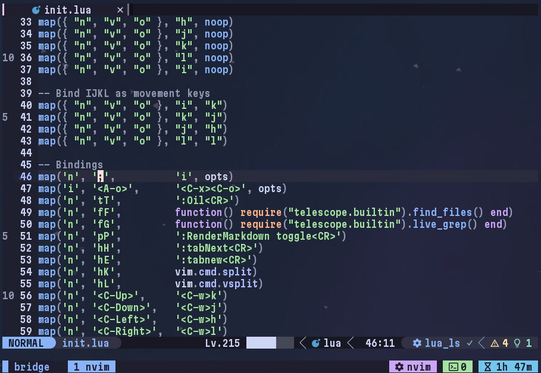

# unobtrusive-relnums.nvim



**unobtrusive-relnums.nvim** is a Neovim plugin that adds unobtrusive relative line numbers to the sign column.

I wrote this plugin for a very specific reason:

I **don't like** how the default relative line numbers look,  
but I **don't hate** the idea of them.

More specifically, I dont' like how visually busy they are by constantly shifting around the current line number. I also don't like how it obscures the exact line numbers.

## Installation (lazy.nvim)

```lua
return {
    "stikypiston/unobtrusive-relnums.nvim",
    opts = {}
}
```

## Configuration

This is the default configuration with all available options, tweak it as you please.

```lua
opts = {
    step         = 5,        -- The increments that the relative numbers should be in
    max_distance = 200,      -- The maximum distance that the numbers render for, in lines
    sign_hl      = "Comment" -- The highlighting group to use as the colour of the numbers
    priority     = 1         -- The rendering priority on the sign column
}
```
